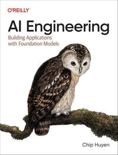

# AI Engineering

[home](../)

## Details

* **Title**: AI Engineering
* **Subtitle**: Building Applications with Foundation Models
* **Authors**: Chip Huyen
* **Publication Date**: 2025
* **Publisher**: O'Reilly
* **ISBN-13**: 978-1098166304
* **Pages**: 532
* **Amazon Rating**: 5/5 stars
* **Goodreads Rating**: 4.57/5 stars

**Links**: [Amazon](https://a.co/d/hAI9OXl) |
[Goodreads](https://www.goodreads.com/book/show/216848047-ai-engineering) |
[Publisher](https://www.oreilly.com/library/view/ai-engineering/9781098166298/) |
[GitHub Project](https://github.com/chiphuyen/aie-book)

## Blurb

Recent breakthroughs in AI have not only increased demand for AI products, they've also lowered the barriers to entry for those who want to build AI products. The model-as-a-service approach has transformed AI from an esoteric discipline into a powerful development tool that anyone can use. Everyone, including those with minimal or no prior AI experience, can now leverage AI models to build applications. In this book, author Chip Huyen discusses AI engineering: the process of building applications with readily available foundation models.

The book starts with an overview of AI engineering, explaining how it differs from traditional ML engineering and discussing the new AI stack. The more AI is used, the more opportunities there are for catastrophic failures, and therefore, the more important evaluation becomes. This book discusses different approaches to evaluating open-ended models, including the rapidly growing AI-as-a-judge approach.

AI application developers will discover how to navigate the AI landscape, including models, datasets, evaluation benchmarks, and the seemingly infinite number of use cases and application patterns. You'll learn a framework for developing an AI application, starting with simple techniques and progressing toward more sophisticated methods, and discover how to efficiently deploy these applications.

* Understand what AI engineering is and how it differs from traditional machine learning engineering
* Learn the process for developing an AI application, the challenges at each step, and approaches to address them
* Explore various model adaptation techniques, including prompt engineering, RAG, fine-tuning, agents, and dataset engineering, and understand how and why they work
* Examine the bottlenecks for latency and cost when serving foundation models and learn how to overcome them
* Choose the right model, dataset, evaluation benchmarks, and metrics for your needs

Chip Huyen works to accelerate data analytics on GPUs at Voltron Data. Previously, she was with Snorkel AI and NVIDIA, founded an AI infrastructure startup, and taught Machine Learning Systems Design at Stanford. She's the author of the book Designing Machine Learning Systems, an Amazon bestseller in AI.

AI Engineering builds upon and is complementary to Designing Machine Learning Systems (O'Reilly).

## Contents

1. Introduction to Building AI Applications with Foundation Models
2. Understanding Foundation Models
3. Evaluation Methodology
4. Evaluate AI Systems
5. Prompt Engineering
6. RAG and Agents
7. Finetuning
8. Dataset Engineering
9. Inference Optimization
10. AI Engineering Architecture and User Feedback
