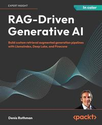

# RAG-Driven Generative AI

[home](../)

## Details

* **Title**: RAG-Driven Generative AI
* **Subtitle**: Build custom retrieval augmented generation pipelines with LlamaIndex, Deep Lake, and Pinecone
* **Authors**: Denis Rothman
* **Publication Date**: 2024
* **Publisher**: Packt
* **ISBN-13**: 978-1836200918
* **Pages**: 334

**Links**: [Amazon](https://a.co/d/2zjaDK4) |
[Goodreads](https://www.goodreads.com/book/show/214330235-rag-driven-generative-ai) |
[Publisher](https://www.packtpub.com/en-us/product/rag-driven-generative-ai-9781836200918) |
[GitHub Project](https://github.com/Denis2054/RAG-Driven-Generative-AI)

## Blurb

Minimize AI hallucinations and build accurate, custom generative AI pipelines with RAG using embedded vector databases and integrated human feedback

Purchase of the print or Kindle book includes a free eBook in PDF format

Key Features
* Implement RAG’s traceable outputs, linking each response to its source document to build reliable multimodal conversational agents
* Deliver accurate generative AI models in pipelines integrating RAG, real-time human feedback improvements, and knowledge graphs
* Balance cost and performance between dynamic retrieval datasets and fine-tuning static data

Book Description
RAG-Driven Generative AI provides a roadmap for building effective LLM, computer vision, and generative AI systems that balance performance and costs.

This book offers a detailed exploration of RAG and how to design, manage, and control multimodal AI pipelines. By connecting outputs to traceable source documents, RAG improves output accuracy and contextual relevance, offering a dynamic approach to managing large volumes of information. This AI book shows you how to build a RAG framework, providing practical knowledge on vector stores, chunking, indexing, and ranking. You’ll discover techniques to optimize your project’s performance and better understand your data, including using adaptive RAG and human feedback to refine retrieval accuracy, balancing RAG with fine-tuning, implementing dynamic RAG to enhance real-time decision-making, and visualizing complex data with knowledge graphs.

You’ll be exposed to a hands-on blend of frameworks like LlamaIndex and Deep Lake, vector databases such as Pinecone and Chroma, and models from Hugging Face and OpenAI. By the end of this book, you will have acquired the skills to implement intelligent solutions, keeping you competitive in fields from production to customer service across any project.

What you will learn
* Scale RAG pipelines to handle large datasets efficiently
* Employ techniques that minimize hallucinations and ensure accurate responses
* Implement indexing techniques to improve AI accuracy with traceable and transparent outputs
* Customize and scale RAG-driven generative AI systems across domains
* Find out how to use Deep Lake and Pinecone for efficient and fast data retrieval
* Control and build robust generative AI systems grounded in real-world data
* Combine text and image data for richer, more informative AI responses

Who this book is for
This book is ideal for data scientists, AI engineers, machine learning engineers, and MLOps engineers. If you are a solutions architect, software developer, product manager, or project manager looking to enhance the decision-making process of building RAG applications, then you’ll find this book useful.

## Contents

1. Why Retrieval Augmented Generation?
2. RAG Embedding Vector Stores with Deep Lake and OpenAI
3. Building Index-Based RAG with LlamaIndex, Deep Lake, and OpenAI
4. Multimodal Modular RAG for Drone Technology
5. Boosting RAG Performance with Expert Human Feedback
6. Scaling RAG Bank Customer Data with Pinecone
7. Building Scalable Knowledge-Graph-Based RAG with Wikipedia API and LlamaIndex
8. Dynamic RAG with Chroma and Hugging Face Llama
9. Empowering AI Models: Fine-Tuning RAG Data and Human Feedback
10. RAG for Video Stock Production with Pinecone and OpenAI
